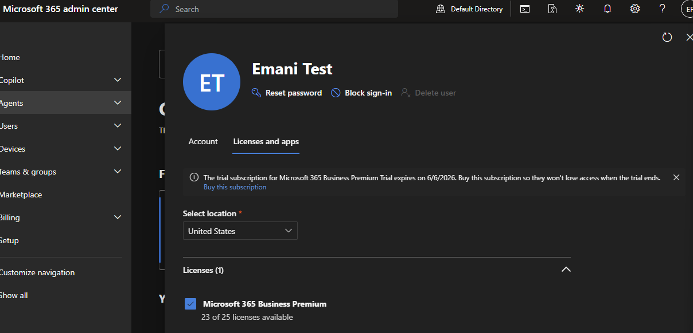
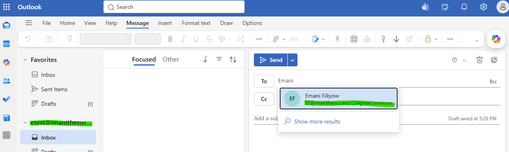
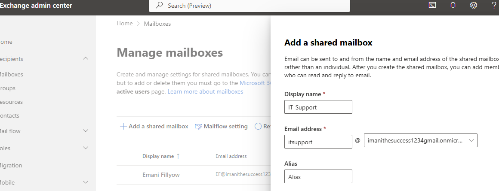
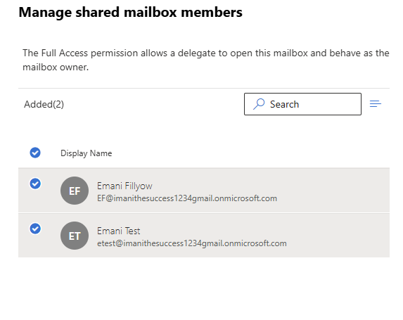
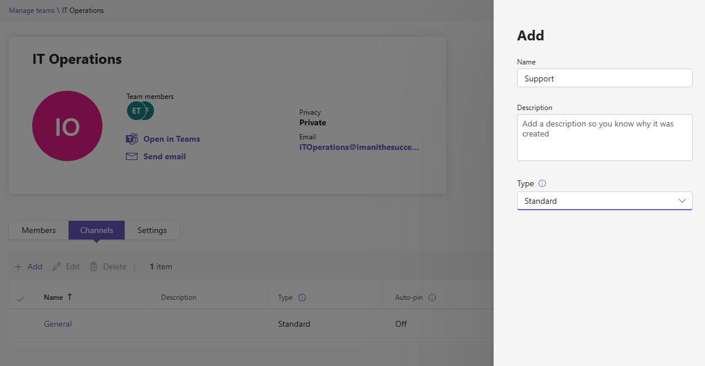
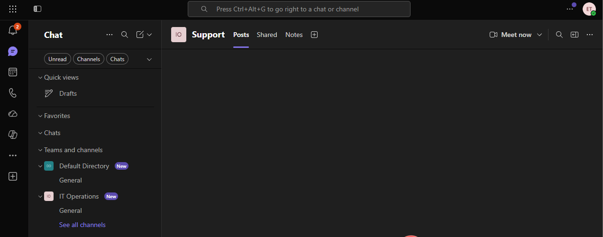
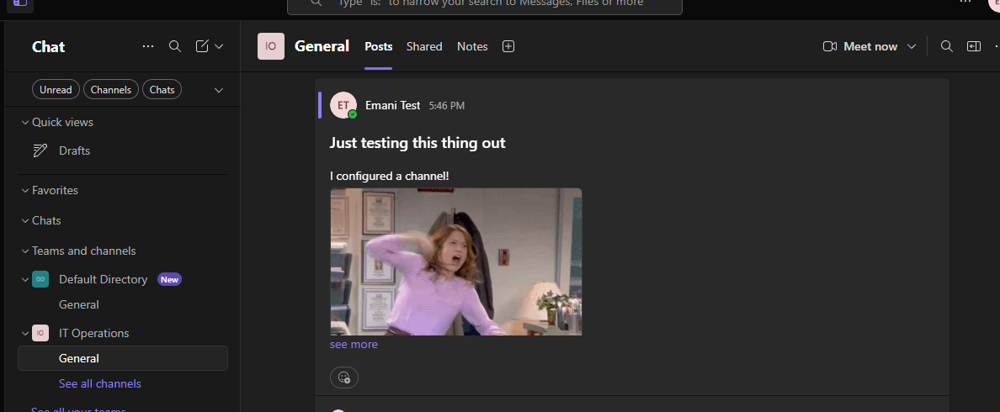
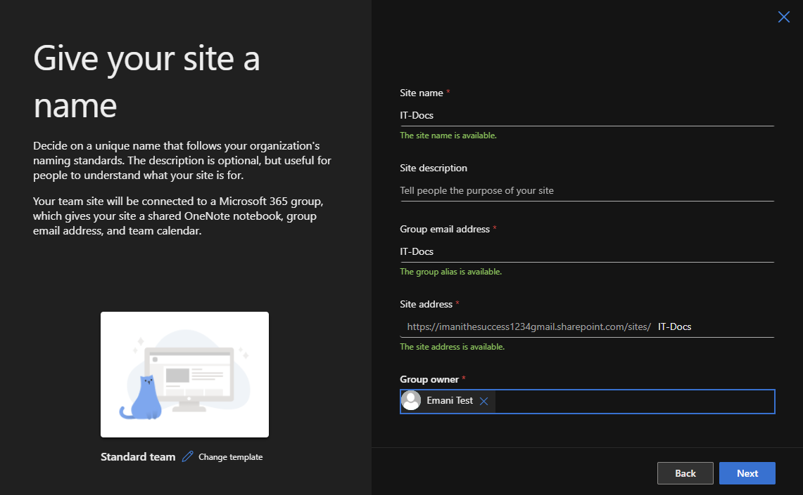
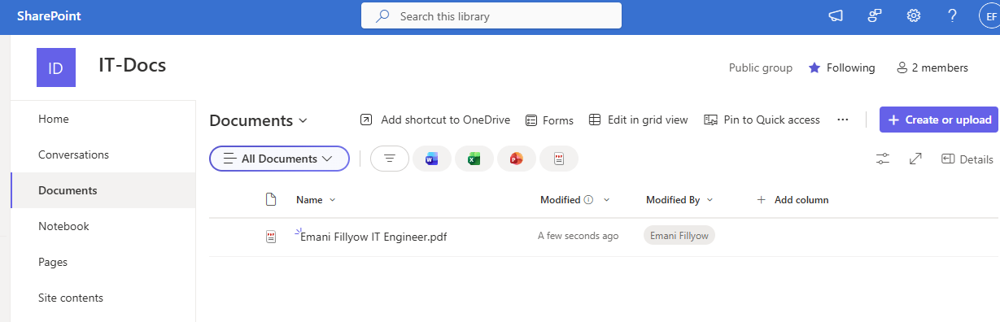
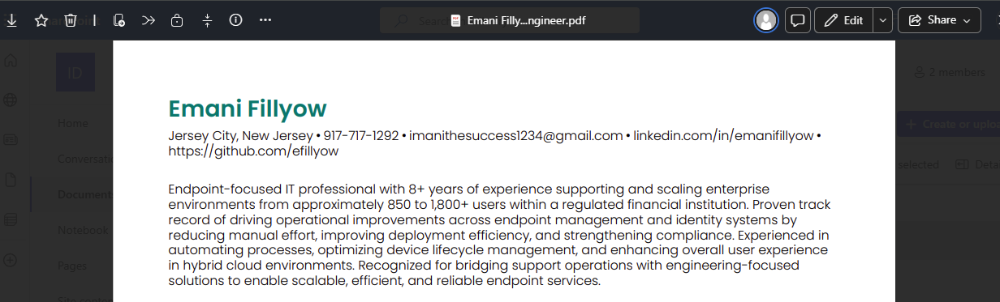

## 💼 Microsoft 365 Service Integration Lab (Exchange, Teams, SharePoint)

---

## 📌 Overview

This lab simulates a real-world enterprise user onboarding scenario by integrating Microsoft 365 services including Exchange Online, Microsoft Teams, and SharePoint.

The goal was to provision a user and validate seamless access across core business services, demonstrating how identity, licensing, and permissions work together in a cloud environment.

---

## 🎯 Objectives

- Assign Microsoft 365 license to a user  
- Provision Exchange Online mailbox  
- Configure shared mailbox access  
- Create and manage Microsoft Teams collaboration  
- Configure SharePoint site and permissions  
- Validate service access across all platforms  

---

## 🏗️ Architecture

### 🔎 How it works

1. A user is created and assigned a Microsoft 365 license  
2. Cloud services are automatically provisioned  
3. Identity and permissions control access  
4. User gains access to email, collaboration, and file storage  

---

## 🔧 Technologies Used

- Microsoft Entra ID  
- Microsoft 365 Admin Center  
- Exchange Online  
- Microsoft Teams  
- SharePoint Online  

---

# ⚙️ Configuration & Implementation

---

## ✅ 1. User Licensing

Assigned a Microsoft 365 license to the test user (`etest`) to enable service provisioning.

  
  

### 🔎 Why this matters

Licensing is the foundation of Microsoft 365:

- Enables Exchange mailbox provisioning ✅  
- Grants access to Teams ✅  
- Provides SharePoint storage and access ✅  

Without licensing:
❌ No services are available to the user  

---

## ✅ 2. Exchange Online Configuration

Verified that the user mailbox was successfully created and tested email functionality.

  
  

  
  

  
  

---

### 🔎 What this proves

- Mailbox provisioning completed successfully  
- Email flow is working correctly  
- User can send and receive messages  

---

### ✅ Shared Mailbox Configuration

Created a shared mailbox and granted full access to the user.

  
  

  
  

---

### 🔎 Why this matters

Shared mailboxes are commonly used in enterprise environments to:

- Allow multiple users to access a common mailbox  
- Centralize communication for teams (e.g., IT support)  
- Enforce role-based access control  

---

## ✅ 3. Microsoft Teams Configuration

Created a Team and configured channels to simulate collaboration workflows.

  
  

  
  

  
  

  
  

---

### 🔎 What this proves

- User is properly added to a collaboration environment  
- Channel-based communication is functional  
- Permissions are applied correctly within Teams  

---

## ✅ 4. SharePoint Configuration

Created a SharePoint site and validated document upload and access.

  
  

  
  

  
  

---

### 🔎 Why this matters

SharePoint provides:

- Centralized file storage  
- Controlled access to documents  
- Collaboration across teams  

---

### 🔎 What this proves

- User has access to the SharePoint site  
- Files can be uploaded and retrieved successfully  
- Permissions are functioning as expected  

---

# 🧪 End-to-End Validation

Performed validation to ensure the user could access all services:

- ✅ Outlook (send/receive email)  
- ✅ Microsoft Teams (team + channel access)  
- ✅ SharePoint (file access and visibility)  

---

## ✅ Result

- User successfully provisioned across all Microsoft 365 services  
- Identity-based access confirmed  
- Permissions validated across platforms  

---

# 🎯 Outcome

- Successfully simulated enterprise user onboarding  
- Demonstrated integration between identity and M365 services  
- Validated user experience across communication and collaboration platforms  

---

# 💼 Skills Demonstrated

- Microsoft 365 Administration  
- Exchange Online Management  
- Microsoft Teams Configuration  
- SharePoint Administration  
- User Provisioning & Licensing  
- Identity & Access Integration  

---

# 🧠 Key Takeaways

- Microsoft 365 licensing controls service availability  
- Identity drives access across all cloud services  
- Permissions must be configured properly for usability  
- End-to-end validation is critical to ensure real-world functionality  

---

## 🧠 Real-World Relevance

This lab reflects how organizations provision users and grant access to essential business tools such as email, collaboration platforms, and file storage services within Microsoft 365 environments.

---
